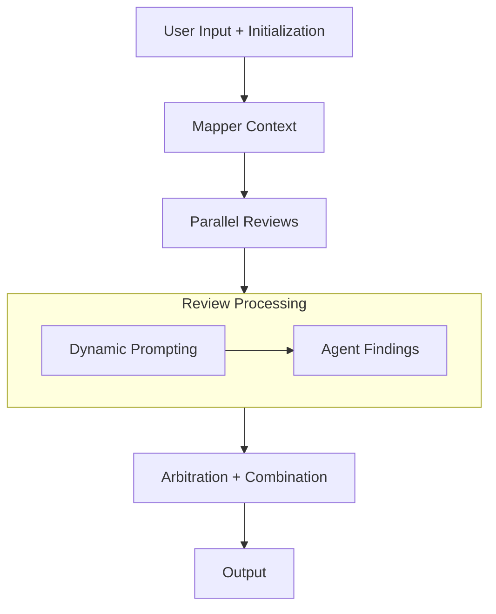

# code-review-agent

A code review agent that focuses on security and performance aspects. Built for GDG York case competition.

## How it Works

1. **User Input + Initialization**: Inputs a receive a pull request diff and initalizes strictly typed `ReviewState` object.
2. **Mapping Context**: The Context Agent reads the code and fills the `ContextModel` state.
3. **Parallel Reviews**: The ADK workflow branches for the multi-agent review. Both the Security and Performance Agent read the code and the `ContextModel`.
   a. Dynamic Prompting: If the Context flags specific data states, the Security Agent dynamically looks for integer overflow or rounding exploits.
   b. Agent Findings: Both agents add their findings as `List[FindingModel]` back into the shared state.
4. **Arbitration + Combination**: The Coordinator reads the entire state, resolviing any conflicting advice between Security and Performance, formating the data, and writes a final markdown string into the state's final_report field.
5. **Output**: The workflow would complete, exracting `final_report`, saving it to `report.md`.

## Visual Pipeline

Why data_classification? Because
