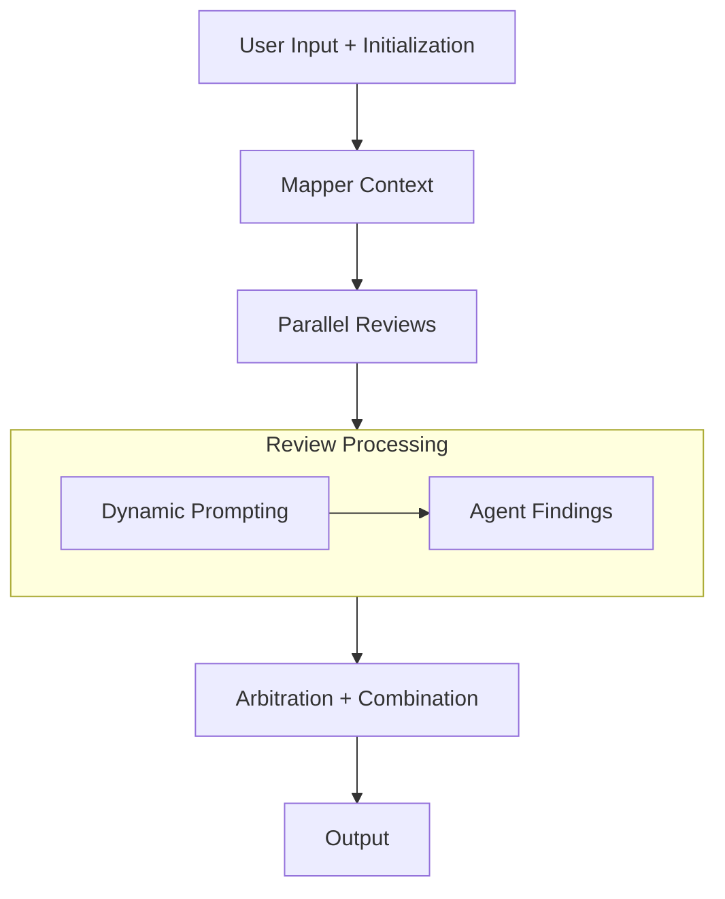

# code-review-agent

A code review agent that focuses on security and performance aspects. Built for GDG York case competition.

## How it Works

1. **User Input + Initialization**: Inputs a receive a pull request diff and initalizes strictly typed `ReviewState` object.
2. **Mapping Context**: The Context Agent reads the code and fills the `ContextModel` state.
3. **Parallel Reviews**: The ADK workflow branches for the multi-agent review. Both the Security and Performance Agent read the code and the `ContextModel`.
   1. Dynamic Prompting: If the Context flags specific data states, the Security Agent dynamically looks for integer overflow or rounding exploits.
   2. Agent Findings: Both agents add their findings as `List[FindingModel]` back into the shared state.
4. **Arbitration + Combination**: The Coordinator reads the entire state, resolving any conflicting advice between Security and Performance, formating the data, and writes a final markdown string into the model `ReportOutput`.
5. **Output**: The workflow would complete, exracting `final_report`, saving it to `reports/report.md`.

## Visual Pipeline

## Key Decision Points

Why `data_classification`? Agents can treat all code equally when doing an analysis, so having the context report feed the agent specific information like data_classification, it can help the agent fully cover issues regarding security. This ultimately saves tokens and reduces hallucinations for security threats.

Why abstract `finding_model`? Unifying the basic fields makes the final step for the coordinator much easier as it helps with cross referencing findings and grouping up severity. Although **standard bug reports** follow more detailed steps, having an abstraction reduces tokens and allows seamless comparison for the coordinator agent.

Originally, we wanted the agents to run **concurrently** for performance sake, however, since we are using the free tier for our `GOOGLE_API_KEY`, we faced a lot of token limitations. If we were on a paid plan, we can run them concurrently making it faster, but to save our system from failing at the last step (running out of tokens for the coordinator), we decided to change it to linear. 

- Drawbacks: Security and Performance findings usually need more fields personalized fields, like `exploitability` and `time complexity` respectfully.
- Fix: we can do polymorphic models with pydantic's inheritance to get both instances if we want to fine-tune it more.

