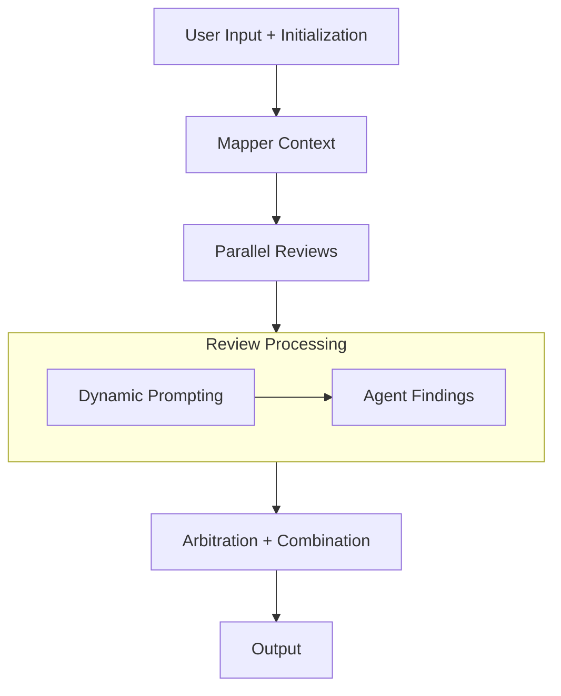

# code-review-agent

A code review agent that focuses on security and performance aspects. Built for GDG York case competition.
Youtube Demo: [here](https://www.youtube.com/watch?v=ED3WgY3tLek)

## Problem

Shipping features has never been faster with AI, but code reviews haven't scaled to match. Developers push code daily, but the review process is still largely manual, and that gap is growing.

**Reviewer fatigue is real.** When engineers are asked to approve dozens of pull requests a day, reviews become shallow. A fatigued reviewer skims for logic errors and misses the subtle issues that cause the most damage: a SQL query built with string interpolation, a password hashed with MD5, or an endpoint missing an ownership check. The problem isn't intent, it's cognitive load and time.

**Security expertise is unevenly distributed.** Most developers aren't security engineers. They can catch obvious bugs, but they won't naturally flag that `yaml.load()` without `SafeLoader` is a code execution risk, or that using `random` instead of `secrets` for token generation opens an auth bypass. Security knowledge is specialized, and not every PR has a specialist reviewer.

**Performance regressions are invisible in a diff.** An N+1 database query looks like clean code in isolation. A recursive function with no memoization looks correct. The performance cost only becomes visible at scale, long after the code is in production and the context is gone.

**The result:** bottlenecked deployments when reviews pile up, a false sense of security from rubber-stamp approvals, and vulnerabilities that reach production not because anyone was careless, but because no single reviewer had the time, context, and breadth to catch everything.

## How it Works

1. **User Input + Initialization**: Inputs a receive a pull request diff and initalizes strictly typed `ReviewState` object.
2. **Mapping Context**: The Context Agent reads the code and fills the `ContextModel` state.
3. **Parallel Reviews**: The ADK workflow branches for the multi-agent review. Both the Security and Performance Agent read the code and the `ContextModel`.
   1. Dynamic Prompting: If the Context flags specific data states, the Security Agent dynamically looks for integer overflow or rounding exploits.
   2. Agent Findings: Both agents add their findings as `List[FindingModel]` back into the shared state.
4. **Arbitration + Combination**: The Coordinator reads the entire state, resolving any conflicting advice between Security and Performance, formating the data, and writes a final markdown string into the model `ReportOutput`.
5. **Output**: The workflow would complete, exracting `final_report`, saving it to `reports/report.md`.

## Visual Pipeline



## Key Decision Points

Why `data_classification`? Agents can treat all code equally when doing an analysis, so having the context report feed the agent specific information like data_classification, it can help the agent fully cover issues regarding security. This ultimately saves tokens and reduces hallucinations for security threats.

Why abstract `finding_model`? Unifying the basic fields makes the final step for the coordinator much easier as it helps with cross referencing findings and grouping up severity. Although **standard bug reports** follow more detailed steps, having an abstraction reduces tokens and allows seamless comparison for the coordinator agent.

We are running the specialized agents concurrently for performance sake (we actually got that from our pr'ing this file lol). We were struggling with token usage so we ran it linearly. However with the sleep, it helps wait for tokens to be available with our limited free tier. 

- Drawbacks: Security and Performance findings usually need more fields personalized fields, like `exploitability` and `time complexity` respectfully.
- Fix: we can do polymorphic models with pydantic's inheritance to get both instances if we want to fine-tune it more.

Implemented `application_type` and `trust_boundary` after using the code-review-agent on itself. Mainly highlighting real-world application for security, since we want to make it more accurate.

## Google Technologies Used

- Gemini API
- Google ADK

## Improvements with More Time
- We would add Arize Phoenix to track the agents and improve observability to the steps taken by the agents. This would help us get a better understanding of the agents bahaviour and allow us to easily adjust the prompt and debug any issues that arise.
- Create and connect the agent to a frontend so that users can easily see the vulnerabilities in their code from an uploaded file or github pull request link.
- Improve the prompts for agents so that there is a hierarchy of vulnerabilities to look out for that are common and are often overlooked in code reviews.

## Setup

### Prerequisites

#### Install uv

`uv` is the package manager used for this project. Install it before anything else.

macOS / Linux:
```bash
curl -LsSf https://astral.sh/uv/install.sh | sh
```

Windows:
```powershell
powershell -ExecutionPolicy ByPass -c "irm https://astral.sh/uv/install.ps1 | iex"
```

Verify the installation:
```bash
uv --version
```

### Python Environment

Clone the repo and initialize the environment:

```bash
uv venv
uv sync
```

If dependencies change or you pull new commits:

```bash
uv sync
```

### Running the Application

Inline code snippet:
```bash
uv run python main.py --code "def add(a, b): return a + b"
```

File (or stdin with `-`):
```bash
uv run python main.py --file path/to/code.py
```

GitHub PR (public repos only — URL or short form):
```bash
uv run python main.py --pr https://github.com/owner/repo/pull/123
uv run python main.py --pr owner/repo#123
```

Built-in demo:
```bash
uv run python main.py --demo
```

#### Custom Output Path
```bash
uv run python main.py --demo --output "report_pr-#2.md"
```
